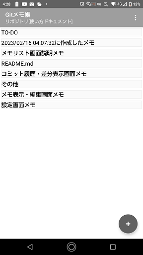
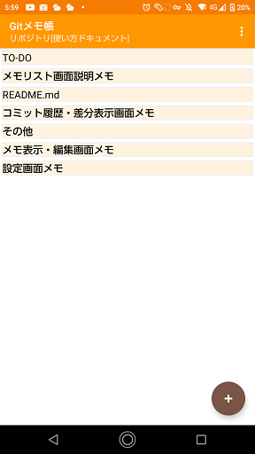
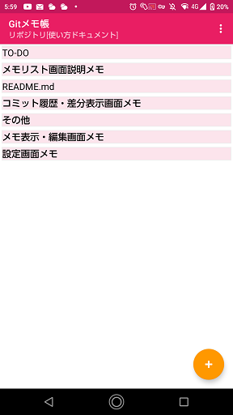
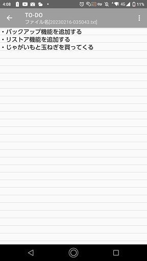
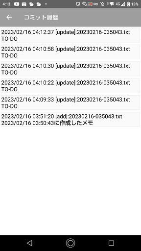
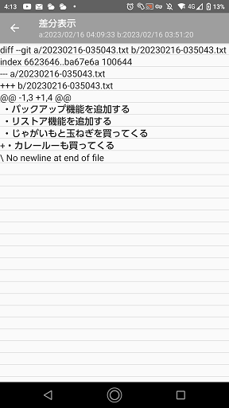
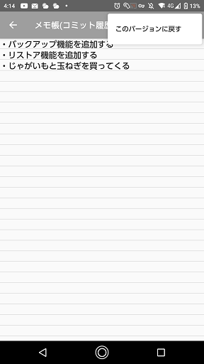
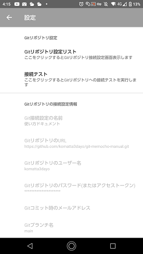
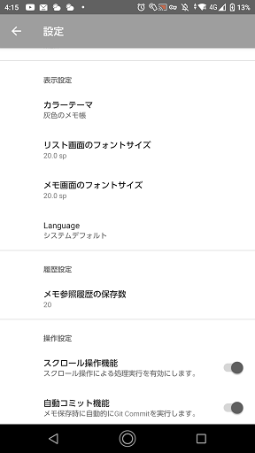

# Gitメモ帳
## このアプリについて
- メモ帳アプリです。
- メモのバージョン管理ができます。
  - メモの内容を過去に保存した内容に戻すことが可能です。
  - バージョン管理にはアプリ内蔵のGitリポジトリを利用しています。
  - GitHubなどの外部のGitリポジトリが使用できます。
- Markdownファイルの表示ができます。
- メモ編集時に入力内容のUndo/Redoが可能です。
- メモの検索が可能です。
- メモの一覧表示、ファイルのツリー表示できます。

## できないこと・制約事項
- Gitリポジトリの接続はhttpsのみ。ssh接続は対応していません。
- GitHubなどの外部のGitリポジトリのアカウントは各自で取得が必要です。
- 登録可能なGitリポジトリは5つまでです。
- Gitブランチの作成、選択の機能がありません。デフォルトブランチのみ使用可能です。
- 巨大なリポジトリのgit cloneはできません。(エラーになります)
- Markdownはテキスト表示のみ。画像表示、リンク先への移動はできません。
- メモはリポジトリ直下のディレクトリに作成される。保存先のディレクトリは選択できません。
- ファイルのコピー、移動といった操作はできません。

## 使い方
- [メモリスト画面](./list/index.md)
- [メモ編集・参照画面](./editor/index.md)
- [コミット履歴・差分表示画面](./git-log/index.md)
- [設定画面](./settings/index.md)

## 画面構成：
- メモリスト画面(色の選択が可能)  
  

- メモ編集・参照画面  
-

- コミット履歴・差分表示画面  
  

- 設定画面  
 

