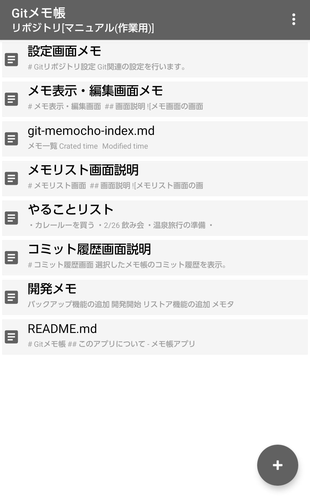
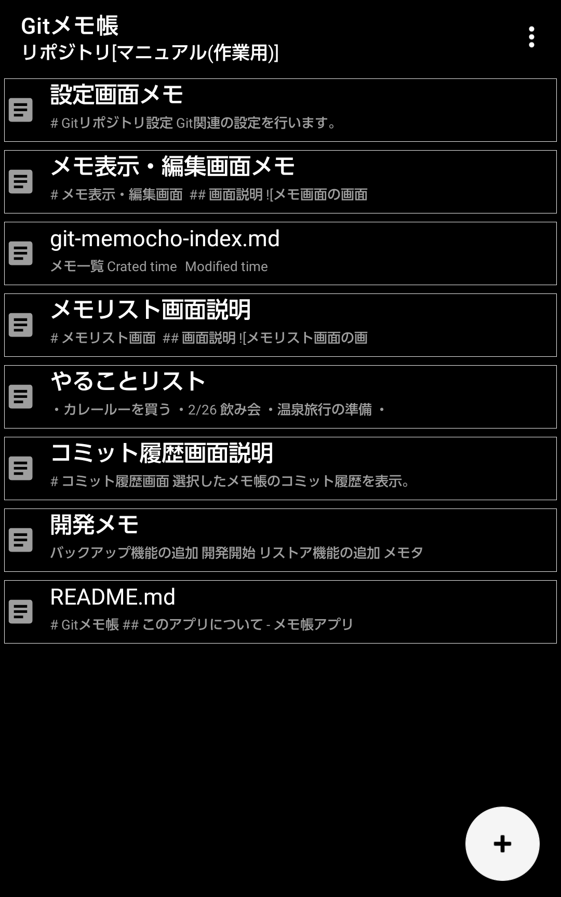
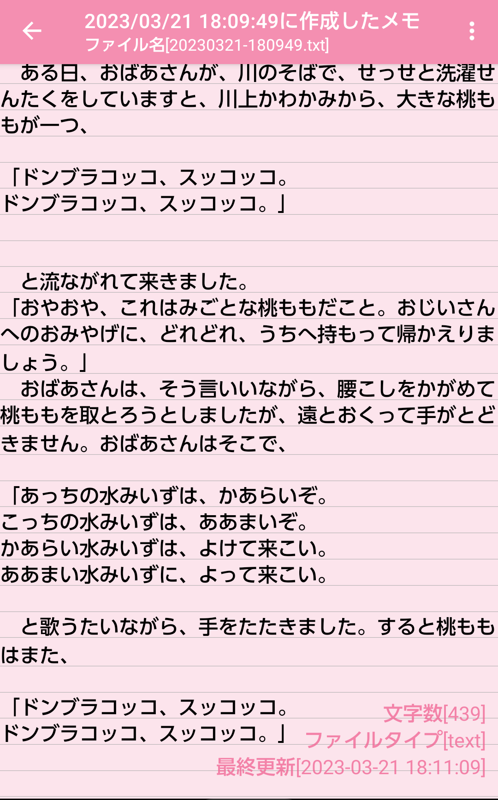
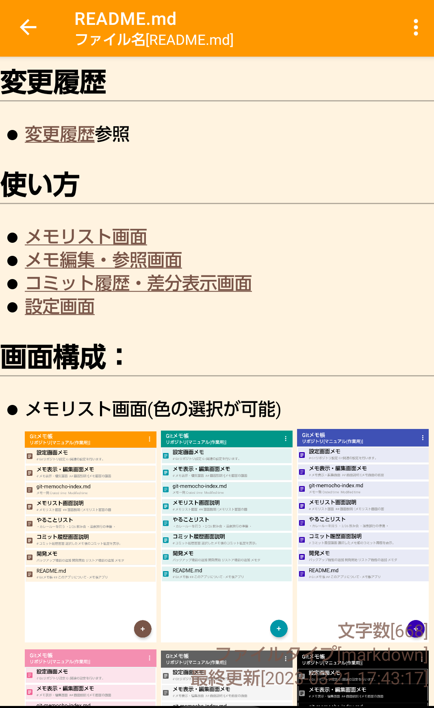
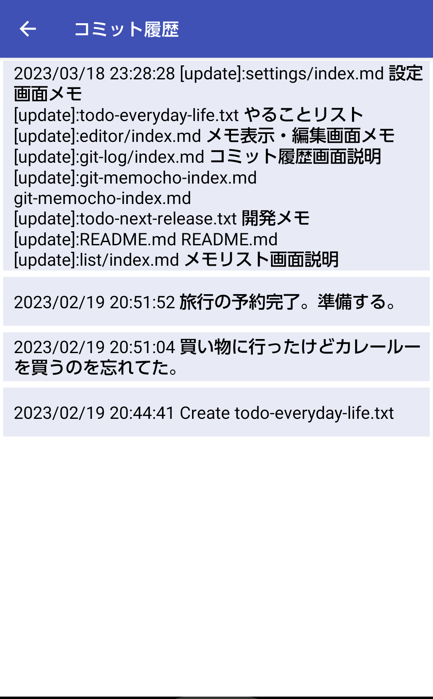
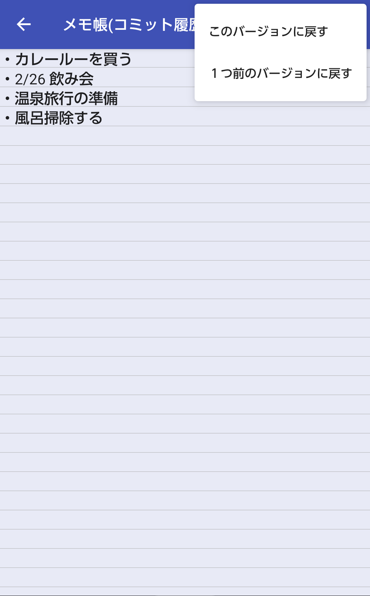
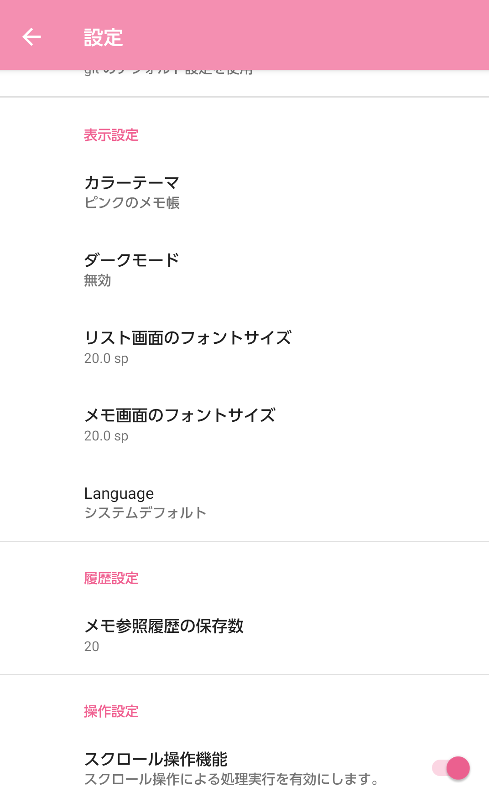

# Gitメモ帳
https://play.google.com/store/apps/details?id=com.github.komatta3dayo.gitmemo

## このアプリについて
- メモ帳アプリです。
- メモのバージョン管理ができます。
  - メモの内容を過去に保存した内容に戻すことが可能です。
  - アプリ内蔵のGitリポジトリを利用しています。
  - GitHubなどの外部のGitリポジトリも使用できます。
- Markdownファイルの表示ができます。
- メモの検索が可能です。
- メモの一覧表示、フォルダ表示ができます。

## できないこと・制約事項
- Gitリポジトリの接続はhttpsのみ。ssh接続は対応していません。
- GitHubなどの外部のGitリポジトリのアカウントは各自で取得が必要です。
- 登録可能なGitリポジトリは10個までです。
- 巨大なリポジトリのgit cloneはできません。(エラーになります)

## 変更履歴
- [変更履歴](./release.md)参照

## 使い方
- [メモリスト画面](./01-list/index.md)
- [メモ編集・参照画面](./02-editor/index.md)
- [コミット履歴・差分表示画面](./03-git-log/index.md)
- [設定画面](./04-settings/index.md)

## 画面構成：
- メモリスト画面(色の選択が可能)  
  
  
- メモリスト画面(フォルダ表示)  
 

- メモ編集・参照画面  
   

- コミット履歴・差分表示画面  
   

- 設定画面  
  

