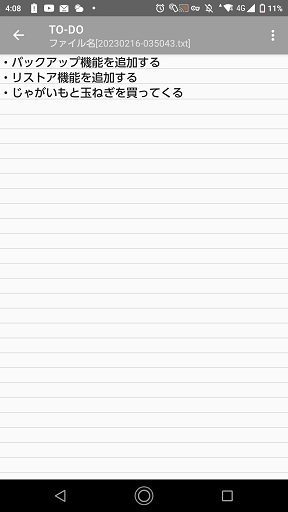
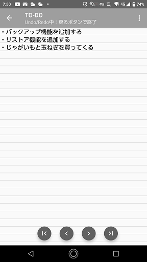
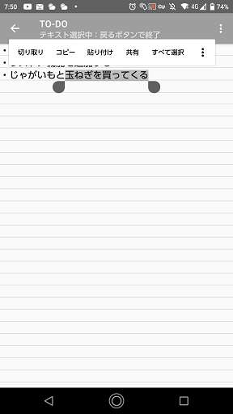

# メモ表示・編集画面

## 画面説明

- タイトルバー
タイトル
画面左上に表示中のメモのタイトルが表示されます。  
また、ファイルや操作の情報を表示します。
- Markdownファイルの場合  
  ファイルタイプ[markdown]と表示されます。
- 閲覧履歴表示中の場合  
  履歴[<履歴番号>]と表示されます.
- 操作の状態  
  テキスト選択モード、Undo/Redoモード、編集モード、検索モード中の場合はそれぞれの状態を表示します。

- 画面右上にメニューがあります。タップするとメニューが表示されます。

## メニュー
メニューを開くと以下のメニューアイテムが表示されます。
- ファイルタイプ変更  
 ファイル表示形式をテキストまたはMarkdownに変更します。
- タイトル変更  
  メモのタイトルを変更します。
- 検索  
  テキスト内の文字列を検索するための検索バーを表示します。  
   
## 画面操作
### メモを編集する。
画面をダブルタップすると編集モードになります。  

- 保存ボタン  
  メモを保存します。  
  デフォルトで自動保存が有効になっていますが、自動保存を無効にした場合などに手動でメモを保存したい場合に使います。
- Undo/Redoボタン  
  Undo/Redoモードに移動します。  
  
### Undo/Redo
メモ編集中にUndo/RedoボタンをタップするとUndo/Redoモードになります。  

- 全Undoボタン
  一番左端のボタン。メモの内容を編集前の状態に戻します。
- Undoボタン
  左から2つめのボタン。変更を１つ元の状態に戻します。
- Redoボタン  
  右から２つめのボタン。Undoを１つ取り消します。
- 全Redoボタン  
  一番右端のボタン。Undoをすべて取り消します。 

### テキストを選択
画面をロングタップするとテキスト選択モードになります。  
テキストの内容のコピーなどができます。  

## スクロール操作
- 上下スクロールで画面スクロールを行う。
  - 右スクロール -> 下スクロール -> 離すと先頭へ移動、それ以外はキャンセル
  - 右スクロール -> 上スクロール -> 離すと最後へ移動、それ以外はキャンセル
 - オプションメニュー
   - オプションメニューからテキストかMarkDownかの設定が可能。
   - オプションメニューからタイトル編集が可能。

