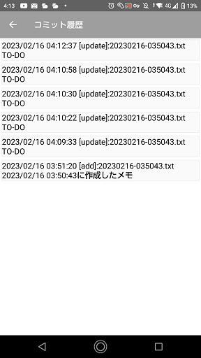
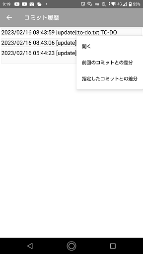
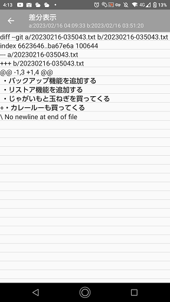
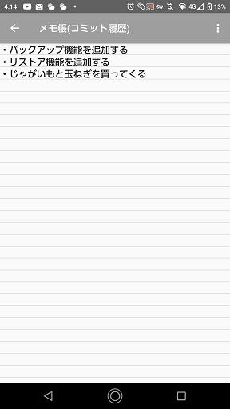
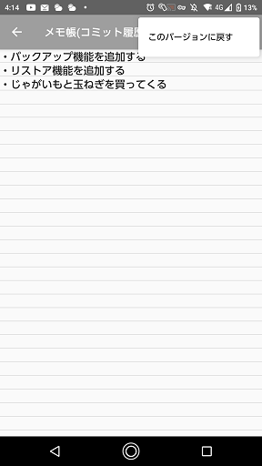

# コミット履歴画面
選択したメモ帳のコミット履歴を表示。  

## 操作方法
### 履歴をロングタップ
履歴をロングタップでコンテキストメニュー表示  

- 開く  
  選択したバージョンのメモを開きます。
- 前回のコミットとの差分  
  変更前の状態からの差分を表示します。
- 指定したコミットとの差分
  選択したバージョンとの差分を表示します。

# 差分表示画面
選択したバージョンと前回または指定したバージョンとの差分を表示。  

# メモ(変更履歴)画面
選択したバージョンのメモ内容の表示。  

## 操作方法
### メニュー
  画面右上のメニューをタップすると各種メニューが表示されます。  

- このバージョンに戻す  
  `このバージョンに戻す`をタップするとメモの内容がこのバージョンに戻ります。

