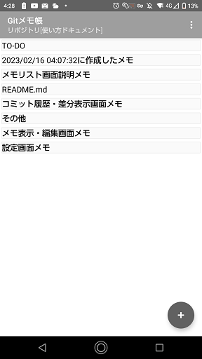
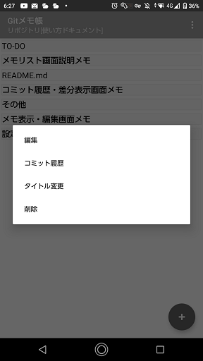
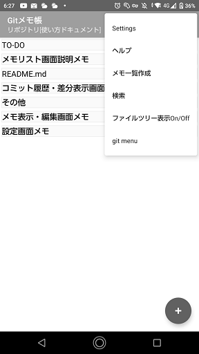

# メモリスト画面

## 画面説明

- タイトルバー
  - タイトル
    画面左上に使用中のGitリポジトリ設定名が表示されます。デフォルトではアプリ内蔵のGitリポジトリが使用されます。
  - メニュー
    画面右上にメニューがあります。タップするとメニューが開きます。

- メモリスト
  - タイトルバーの下にメモのリストが表示されます。
  - メモリストにはメモアイテムが表示されます。
　- メモを作成するとメモリストにメモアイテムとして追加されます。

- メモアイテム
  - メモのタイトルを表示します。
  - ステータス表示
    - メモのコミット状態を表示します。
    - 新規作成したメモがまだコミットされていない場合は「？」と表示されます。
    - 修正したメモがまだコミットされていない場合は「M」と表示されます。
    - コンフリクトが発生した場合には「!」と表示されます。

- 新規メモ作成ボタン
    - クリックすると新規メモ作成画面をします。

## 操作方法
### メモ追加ボタン
`メモ追加ボタン`をクリックするとメモ編集画面に移動します。

### メモをロングタップ
メモをロングタップでコンテキストメニュー表示  

- 編集  
  選択したメモを編集モードで開きます。
- コミット履歴  
  選択したメモのコミット履歴を表示します。
- タイトル変更  
  選択したメモのタイトルを変更します。
- 削除  
  選択したメモを削除します。

### メニュー
  画面右上のメニューをタップすると各種メニューが表示されます。  
  
- 設定メニュー  
  `settings`をタップするとアプリ設定画面に移動します。
- ヘルプメニュー  
  `ヘルプ`をタップするとブラウザが起動してヘルプページを表示します。

- メモ一覧作成メニュー  
  メモのタイトルとファイル名、作成日、更新日を記載したMarkdownファイルを生成します。
- 検索  
  メモの内容を全文検索するための検索バーを表示します。
- ファイルツリー表示On/Off  
  メモ一覧表示とファイルツリー表示の切り替えを行います。
- git menu  
  git commit、git pull、git pushの選択ダイアログを表示します。
  
### git menu
- git commit  
  git commit用のダイアログを表示します。  
  デフォルトで自動コミットが有効になっていますので、手動でコミットを行いたい場合などに使用します。
- git pull  
  git pullを実行します。
- git push  
  git pushを実行します。

### スクロール操作
- 画面を何回かスクロールすると次の処理が実行可能です。
- 右スクロール  
  メモ帳閲覧履歴から古い順にメモを表示する。
- 左スクロール  
  メモ帳閲覧履歴から新しい順にメモを表示する。
- 右スクロール -> 下スクロール  
  メモリストの先頭を表示。
- 右スクロール -> 上スクロール  
  メモリストの最後を表示。
- 左スクロール -> 下スクロール  
  Git pullを実行。
- 左スクロール -> 上スクロール  
  Git pushを実行。
- 左スクロール -> 右スクロール   
  Gitコミット用のダイアログ表示。
- 左スクロール -> 右スクロール -> 左スクロール  
  Gitリポジトリの選択ダイアログ表示
- 右スクロール -> 左スクロール  
  検索バーを表示します。
- 右スクロール -> 左スクロール -> 右スクロール   
  ファイルツリー表示On/Offを実行します。

