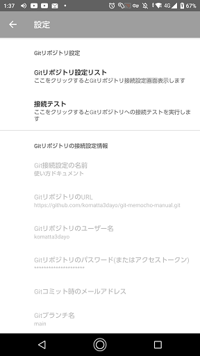
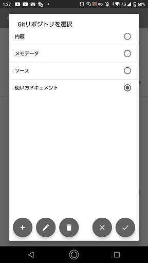
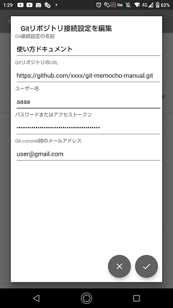
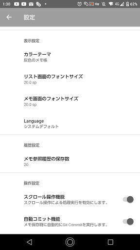
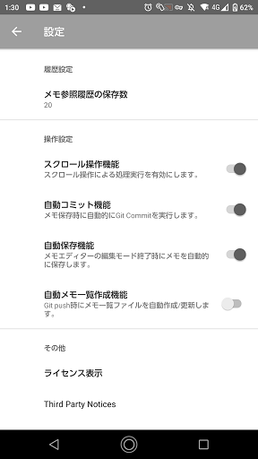

# Gitリポジトリ設定
Git関連の設定を行います。  

## Gitリポジトリ接続設定リスト
- 一番左端のボタンをタップすると`Gitリポジトリ接続設定を編集`ダイアログが表示され、新規の設定を追加できます。

  - Git接続設定の名前  
    任意の名前を設定します。この名前がメモリスト画面のタイトルの一部に使用されます。
  - GitリポジトリのURL
    GitリポジトリのURLを設定します。現在はhttps接続のみ可能であり、ssh接続は使用できません。
  - ユーザー名
    Gitリポジトリ接続時のユーザー名を設定します。ユーザー認証が不要な場合は設定不要です。
  - パスワードまたはアクセストークン
    Gitリポジトリ接続時のパスワードまたアクセストークンを設定します。  
    Githubを利用する場合はアクセストークンが必要になります。
    参考:[個人用アクセス トークンの作成](https://docs.github.com/ja/authentication/keeping-your-account-and-data-secure/creating-a-personal-access-token)
  - Git commit時のメールアドレス  
    git commit時のメールアドレスを設定します。  
    デフォルトでは架空のメールアドレス`user@example.com`としています。
    
- 左から2番目のボタンをタップすると  `Gitリポジトリ接続設定を編集`ダイアログが表示され、既存の設定を編集できます。
- 左から3番目のボタンをタップすると、選択中の設定が削除されます。
- 右から2番目のボタンはキャンセルボタンです。変更を保存せずに画面を閉じます。
- 一番右側のボタンはOKボタンです。変更を保存して画面を閉じます。

=======

## Gitリポジトリ接続設定リスト

- 一番左端のボタンをタップすると`Gitリポジトリ接続設定を編集`ダイアログが表示され、新規の設定を追加できます。
  - Git接続設定の名前  
    任意の名前を設定します。この名前がメモリスト画面のタイトルの一部に使用されます。

- GitリポジトリのURL
    GitリポジトリのURLを設定します。現在はhttps接続のみ可能であり、ssh接続は使用できません。

- ユーザー名
    Gitリポジトリ接続時のユーザー名を設定します。ユーザー認証が不要な場合は設定不要です。

- パスワードまたはアクセストークン
    Gitリポジトリ接続時のパスワードまたアクセストークンを設定します。  
    Githubを利用する場合はアクセストークンが必要になります。
    参考:[個人用アクセス トークンの作成](https://docs.github.com/ja/authentication/keeping-your-account-and-data-secure/creating-a-personal-access-token)

- Git commit時のメールアドレス  
    git commit時のメールアドレスを設定します。  
    デフォルトでは架空のメールアドレス`user@example.com`としています。
    
- 左から2番目のボタンをタップすると  `Gitリポジトリ接続設定を編集`ダイアログが表示され、既存の設定を編集できます。
- 左から3番目のボタンをタップすると、選択中の設定が削除されます。
- 右から2番目のボタンはキャンセルボタンです。変更を保存せずに画面を閉じます。
- 一番右側のボタンはOKボタンです。変更を保存して画面を閉じます。

# 表示設定
画面表示に関する設定を行います。  

## カラーテーマ
- 画面の色を変更します。
## リスト画面のフォントサイズ
- リスト画面のフォントサイズを変更します。
## メモ画面のフォントサイズ
- メモ画面のフォントサイズを変更します。
## Launguage
- 画面表示の言語を変更します。現在選択可能な言語は`日本語`と`英語`です。

# 履歴設定・操作設定・その他

## 履歴設定
## メモ参照履歴の保存数
- メモ履歴表示で遡れる履歴の数を設定します。

# 操作設定
## スクロール操作機能
- スクロール操作による処理実行の有効/無効を設定します。
- デフォルトは有効です。

## 自動コミット機能
- 有効の場合はメモ保存時に自動でgit commitを実行します。
- デフォルトは有効です。

## 自動保存機能
- 有効の場合はメモを閉じた際に自動で変更内容を保存します。
- デフォルトは有効です。

## 自動メモ一覧作成機能
- 有効の場合はgit push時に自動でメモ一覧作成、コミットを行いgit pushの中に含めます。
- デフォルトは無効です。

# その他
## ライセンス表示
- このアプリのライセンス表示です。

## Third Party Notices
- このアプリが使用しているライブラリのライセンス表示です。

## 設定のリセット
- 設定画面の内容を初期状態にリセットします。
